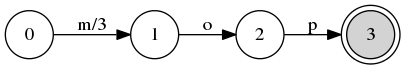
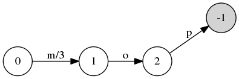
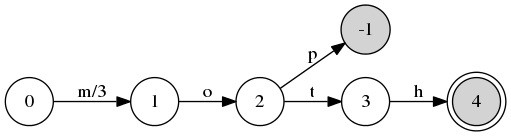
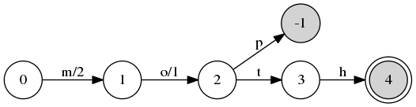
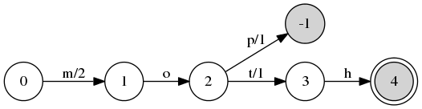
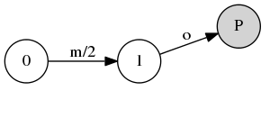
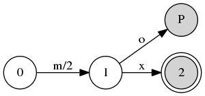
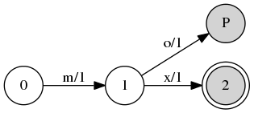
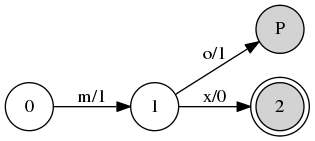
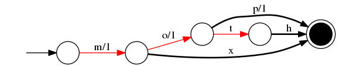

# Let's Get Started

---

@snap[text-blue text-20 text-bold font-righteous]
- mop/3
- moth/2
- mx/1
@snapend

---?color=linear-gradient(to right, #5384AD, #5384AD 40%, white 40%, white)

@snap[west span-40 h3-white]
### mop/3
@snapend

@snap[east span-60 text-center fragment]

@snapend

---?color=linear-gradient(to right, #5384AD 40%, white 40%)

@snap[west span-40 h3-white]
### moth/2
@snapend

@snap[east span-60 text-center fragment]

@snapend

@snap[east span-60 text-center fragment]

@snapend

@snap[east span-60 text-center fragment]

@snapend

@snap[east span-60 text-center fragment]

@snapend

@snap[east span-60 text-center fragment]

@snapend

---?color=linear-gradient(to right, #5384AD 40%, white 40%)

@snap[west span-40 h3-white]
### mx/1
@snapend

@snap[east span-60 text-center fragment]

@snapend

@snap[east span-60 text-center fragment]

@snapend

@snap[east span-60 text-center fragment]

@snapend

@snap[east span-60 text-center fragment]

@snapend

---

---
# Q&A

