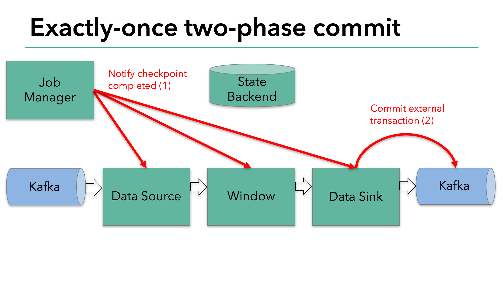

# Apache Flink in a Nutshell


---?color=linear-gradient(to right, SteelBlue, white)

@snap[midpoint span-80 text-center text-white text-13 font-righteous]
@ol[list-spaced-bullets](false)
1. A Brief History of Massive-Scale Data Processing
2. Flink as a Streaming System
3. Flink as a Distributed System
@olend
@snapend


---

## A Brief History of Massive-Scale Data Processing


---

@snap[text-06]
```plaintext
 MapReduce                       FlumeJava      Stratosphere       Storm  Trident         Flink
    ||                              ||              ||              ||      ||              ||
  +----+  +----+  +----+  +----+  +----+  +----+  +----+  +----+  +----+  +----+  +----+  +----+  +----+  +----+
==|2003|==|2004|==|2005|==|2006|==|2007|==|2008|==|2009|==|2010|==|2011|==|2012|==|2013|==|2014|==|2015|==|2016|---
  +----+  +----+  +----+  +----+  +----+  +----+  +----+  +----+  +----+  +----+  +----+  +----+  +----+  +----+
            ||                      ||              ||                              ||                      ||
          Hadoop                 MillWheel         Spark                          Dataflow                 Beam
```
@snapend


---?color=linear-gradient(to right, CornflowerBlue 50%, white 50%)

@snap[west span-45 text-center h2-white text-white text-06]
## MapReduce
<br/>
>@fa[quote-left] we designed a new abstraction that allows us to express the simple computations we were trying to perform but hides the messy details of parallelization, fault-tolerance, data distribution and load balancing in a library. [1]
@snapend

@snap[east span-50 text-center]

@snapend


---

@snap[midpoint]

@snapend


---?color=linear-gradient(to right, CornflowerBlue 50%, white 50%)

@snap[west span-45 text-center h2-white text-white text-07]
## FlumeJava
<br/>
>@fa[quote-left] MapReduce works well for computations that can be broken down into a map step, a shuffle step, and a reduce step, but for many real-world computations, a chain of MapReduce stages is required. [2]
@snapend

@snap[east span-50 text-left]

@snapend

@snap[east span-50 text-center fragment]

@snapend


---?color=linear-gradient(to right, CornflowerBlue 50%, white 50%)

@snap[west span-45 text-center h2-white text-white text-07]
## Spark
<br/>
>@fa[quote-left] RDDs are motivated by two types of applications that current computing frameworks handle inefficiently: iterative algorithms and interactive data mining tools. [3]
@snapend

@snap[east span-47 text-center text-lsb text-05 font-righteous]
@fa[quote-left] Indeed, we show that RDDs can efficiently express many cluster programming models that have so far been proposed as separate systems, including MapReduce, DryadLINQ, SQL, Pregel and HaLoop [3]
<br/>

@snapend


---?color=linear-gradient(to right, CornflowerBlue 50%, white 50%)

@snap[west span-45 text-center h2-white text-white text-07]
## Storm
<br/>
>@fa[quote-left] Before Storm, you would typically have to manually build a network of queues and workers to do realtime processing. Workers would process messages off a queue, update databases, and send new messages to other queues for further processing. [4]
@snapend

@snap[east span-47 text-center text-lsb text-06 font-righteous]
@fa[quote-left] Like how <font style="font-size:180%">MapReduce</font> greatly eases the writing of parallel batch processing, Storm's primitives greatly ease the writing of parallel realtime computation. [4]
<br/>

@snapend


---?color=linear-gradient(to right, CornflowerBlue 50%, white 50%)

@snap[west span-45 text-center h2-white text-white text-06]
## Lambda Architecture
<br/>
>@fa[quote-left] The LA aims to satisfy the needs for a robust system that is fault-tolerant, both against hardware failures and human mistakes, being able to serve a wide range of workloads and use cases, and in which low-latency reads and updates are required. [34]
@snapend

@snap[east span-50 text-center]

@snapend

@snap[east span-47 text-center text-lc text-06 text-italic bg-white fragment]
@fa[quote-left] why can’t the stream processing system just be improved to handle the full problem set in its target domain? [35]
@snapend


---?color=linear-gradient(to right, CornflowerBlue 50%, white 50%)

@snap[west span-45 text-center h2-white text-white text-06]
## Kappa Architecture
<br/>
>@fa[quote-left] The fundamental abstraction in stream processing is data flow DAGs, which are exactly the same underlying abstraction in a traditional data warehouse (a la Volcano) as well as being the fundamental abstraction in the MapReduce successor Tez. [35]
@snapend

@snap[east span-47 text-center text-lsb text-06 font-righteous]
@fa[quote-left] there is no reason that a stream processing system can’t give as strong a semantic guarantee as a batch system. [35]
<br/>

@snapend


---?color=linear-gradient(to right, CornflowerBlue, white)

@snap[west span-45 text-center h2-white text-white text-07 font-righteous]
## Trident
<br/>
>@fa[quote-left] a <font style="font-size:150%">micro-batching</font> API on top of Storm that provides exactly-once processing semantics. [5][6]
@snapend

@snap[east span-45 text-left text-cfb text-06 font-righteous]
@fa[quote-left] Each batch of tuples is given a <font style="font-size:180%">UNIQUE ID</font> called the "transaction id" (txid). [7]
<br/>
@fa[quote-left] State updates are <font style="font-size:180%">ORDERED</font> among batches. [7]
@snapend


---?color=linear-gradient(to right, CornflowerBlue 50%, white 50%)

@snap[west span-45 text-center h2-white text-white text-07]
## MillWheel
<br/>
>@fa[quote-left] Comparing MillWheel to existing models for streaming systems, such as Yahoo! S4, Storm, and Sonora, we find that their models are insufficiently general for our desired class of problems. [8]
@snapend

@snap[east span-47 text-left text-lsb text-07 font-righteous]
@ul[list-square-bullets](false)
- Persistent State
- <font style="font-size:150%">LOW WATERMARK</font>
- Exactly-Once Processing
@ulend
<div><br/></div>

@snapend


---?color=linear-gradient(to right, CornflowerBlue 50%, white 50%)

@snap[west span-45 text-center h2-white text-white text-05 font-righteous]
## Dataflow Model
<br/>
>@fa[quote-left] What it does provide is a common framework that allows for the relatively simple expression of parallel computation in a way that is <font style="font-size:150%">INDEPENDENT</font> of the underlying execution engine, while also providing the ability to dial in precisely the amount of latency and <font style="font-size:150%">CORRECTNESS</font> for any specific problem domain given the realities of the data and resources at hand. [9]
@snapend

@snap[east span-47 text-center text-lsb text-05 font-righteous]
@fa[quote-left] We have implemented this model internally in <font style="font-size:150%">FlumeJava</font>, with <font style="font-size:150%">MillWheel</font> used as the underlying execution engine for streaming mode; additionally, an external reimplementation for <font style="font-size:150%">Cloud Dataflow</font> is largely complete at the time of writing. [9]
<br/>

<div style="font-size:60%">[10]</div>
@snapend


---

@snap[midpoint span-70 text-08]
## Beam


@snapend


---

## Flink as a Streaming System


---

@snap[text-09]
```plaintext
                        Release 0.7.0
 Stratosphere[11]       - Flink Streaming
       ||                       ||
    +------+   +--------+   +---------+   +---------+
 ===| 2009 |===| 2014.8 |===| 2014.11 |===| 2015.11 |===
    +------+   +--------+   +---------+   +---------+
                   ||                          ||
           Release 0.6                 Release 0.10.0
           - Apache Flink              - Stateful Streaming/Checkpointing
                                       - EventTime/Watermark
                                       - Inspired by the Dataflow Model. [12]
```
@snapend


---

@snap[north-west span-30 text-center text-07]
## Use Cases
<div style="color:LightSkyBlue;font-size:40%">[13]</div>
@snapend

@snap[north-east span-66 text-left fragment]

@snapend

@snap[east span-66 text-left fragment]

@snapend

@snap[south-east span-66  text-left fragment]

@snapend

@snap[west span-30 text-center text-06 text-gray fragment]
@ul[list-square-bullets](false)
- Fraud Detection
- Anomaly Detection
- Continuous ETL
- Real-Time Search Index Building
@ulend
@snapend


---

@snap[midpoint span-70 text-07]
## Programming Model


<div style="color:LightSkyBlue;font-size:40%">[14]</div>
@snapend


---

@snap[midpoint span-70 text-07]
## Distributed Runtime


<div style="color:LightSkyBlue;font-size:40%">[15]</div>
@snapend


---?color=linear-gradient(to right, CornflowerBlue 50%, white 50%)

@snap[west span-45 text-center h2-white text-white text-07 font-righteous]
## Task Slot
<br/>
>@fa[quote-left] To control how many tasks a worker accepts, a worker has so called task slots (at least one). [16]
@snapend

@snap[east span-47 text-center text-lsb text-06 font-righteous]
@fa[quote-left] Note that no CPU isolation happens here; currently slots only separate the <font style="font-size:180%">MANAGED MEMORY</font>of tasks. [16][17]
<br/>

@snapend


---?color=linear-gradient(to right, white 50%, CornflowerBlue 50%)

@snap[west span-47 text-center text-07]
## Slot Sharing
<br/>

@snapend

@snap[east span-47 text-center text-white text-07 font-righteous]
@fa[quote-left] A Flink cluster needs exactly as many task slots as the highest parallelism used in the job. [16]
<br/>
@fa[quote-left] It is easier to get better resource utilization. [16]
@snapend


---

@snap[text-05 h2-white]
## Network Stack
<br/>
```plaintext
              +--------------------------------------------+                                          +------------------------------+
              |                         +----------------+ |        +-------------------------+       |     Input Gate      |        |
+-------+     | +----------------+  +=> | Subpartition 1 | | <===== |   LocalInputChannel  1  | ==+== | +-----------------+ | Reduce |
| Map 1 | ==> | |   Partition 1  | -|   +----------------+ |        +-------------------------+   |   | | LocalBufferPool | |    1   |
+-------+     | +----------------+  +=> | Subpartition 2 | | <==+                                 |   | +-----------------+ |        |
              |                         +----------------+ |    |                                 |   +------------------------------+
              +--------------------------------------------+    |                                 |
                                                                |                                 |
              +--------------------------------------------+    |   +-------------------------+   |
              |                         +----------------+ |    |   |   RemoteInputChannel 2  |   |
              | +----------------+      | Subpartition 1 | |    |   |  +-------------------+  |   |
              | |   Partition 2  |  +=> |  +---------+   | | <==+== |  | UnannouncedCredit |  | ==+
              | |  +----------+  |  |   |  | Backlog |   | |    |   |  +-------------------+  |
+-------+     | |  |  Local   |  | -|   |  +---------+   | |    |   +-------------------------+
| Map 2 | ==> | |  |BufferPool|  |  |   +----------------+ |    |                                      +-----------------------------+
+-------+     | |  +----------+  |  +=> | Subpartition 2 | | <==+===================================== |   Input Gate   |  Reduce 2  |
              | +----------------+      +----------------+ |                                           +-----------------------------+
              +--------------------------------------------+
```
@snapend


---

@snap[west span-48 text-center text-08 font-righteous]
**<font style="font-size:200%;color:#268bd2">Throughput</font>**
<br/>
```yaml
# Size of memory buffers used by the
# network stack and the memory manager.
taskmanager.memory.segment-size: "32kb"
```
@snapend

@snap[east span-48 text-center text-08 font-righteous fragment]
**<font style="font-size:200%;color:#859900">Latency</font>**
<br/>
```java
// Set buffer timeout to 1 to enable
// continuous flushing of the output
// buffers (lowest latency).
StreamExecutionEnvironment env =
    StreamExecutionEnvironment
    .getExecutionEnvironment()
    .setBufferTimeout(1);
```
@snapend


---?color=linear-gradient(to right, CornflowerBlue, white)

@snap[west span-50 text-center h2-white text-white text-06 font-righteous]
## Backpressure
<br/>
>@fa[quote-left] The backpressure monitor samples the running tasks’ threads on all TaskManagers via <font style="font-size:180%;font-family:Bubblegum">Thread.getStackTrace()</font> and computes the number of samples where tasks were <font style="font-size:150%">BLOCKED</font> on a buffer request. [18][19]
@snapend

@snap[east span-45 text-left text-gray text-06 font-bubblegum]
@ul[list-square-bullets](false)
- **<font style="color:orange;font-size:200%">- Flink 1.8</font>**
    - `outPoolUsage`
    - `inPoolUsage`
- **<font style="color:LightSeaGreen;font-size:200%">Flink 1.9 +</font>**
    - `outPoolUsage`
    - `inPoolUsage`
    - `floatingBuffersUsage`
    - `exclusiveBuffersUsage`
@ulend
@snapend


---?color=linear-gradient(to right, CornflowerBlue, white)

@snap[west span-50 text-center h2-white text-white text-06 font-righteous]
## Stateful Computation
<br/>
>@fa[quote-left] Stateful functions and operators store data across the processing of individual elements/events, making state a critical building block for any type of more elaborate operation. [20]
@snapend

@snap[east span-45 text-left text-cfb text-06]

@ul[list-square-bullets font-righteous text-15](false)
- Keyed State
- Operator State <font style="color:white;font-size:70%">(Non-Keyed State)</font>
@ulend
<div><br/></div>
@ul[font-righteous text-15](false)
- Managed State
- Raw State
@ulend
<div><br/></div>
@ul[list-no-bullets text-white text-bold]
- @fa[bug] Fault Tolerance & Scalability
@ulend

@snapend


---?color=linear-gradient(120deg, CornflowerBlue, white)

@snap[h2-white text-white text-08 font-righteous]
## State Backends
<br/>
@ul[list-square-bullets list-spaced-bullets](false)
- @fa[memory] <font style="font-size:150%">FsStateBackend</font>
- @fa[database] <font style="font-size:150%">RocksDBStateBackend</font>
- MemoryStateBackend
@ulend
@snapend


---?color=linear-gradient(to right, CornflowerBlue 50%, white 50%)

@snap[west span-45 text-center h2-white text-white text-06 font-righteous]
## Watermark
<br/>
>@fa[quote-left] A stream processor that supports <font style="font-size:180%">EVENT TIME</font> needs a way to measure the progress of event time. For example, a window operator that builds hourly windows needs to be notified when event time has passed beyond the end of an hour, so that the operator can close the window in progress. [21]
@snapend

@snap[east span-47 text-center text-lsb text-06 font-righteous]
@fa[quote-left] A *WATERMARK(t)* declares that event time has reached time t in that stream, meaning that there should be no more elements from the stream with a timestamp t' <= t. [21][22]
<br/>

@snapend


---?color=linear-gradient(120deg, CornflowerBlue, white)

@snap[h2-white text-white text-08 font-bubblegum]
## Generating Watermarks
<br/>
@ul[list-square-bullets list-spaced-bullets](false)
- Source Functions with Timestamps and Watermarks
- Timestamp Assigners / Watermark Generators
@ulend
@snapend


---

@snap[west span-48 text-center text-08 font-righteous]
**<font style="font-size:180%;color:white">Late Elements</font>**
<br/>
```java
final OutputTag<T> lateOutputTag =
    new OutputTag<T>("late-data"){};

DataStream<T> input = ...;

SingleOutputStreamOperator<T> result =
    input
    .keyBy(<key selector>)
    .window(<window assigner>)
    .allowedLateness(<time>)
    .sideOutputLateData(lateOutputTag)
    .<transformation>(<window function>);

DataStream<T> lateStream =
    result.getSideOutput(lateOutputTag);
```
@snapend

@snap[east span-48 text-center text-08 font-righteous]
**<font style="font-size:180%;color:white">Idle Sources</font>**
<br/>
```java
/**
 * This is only relevant when running on
 * IngestionTime and EventTime, allowing
 * downstream tasks to advance their
 * watermarks without the need to wait
 * for watermarks from this source while
 * it is idle.
 */
void markAsTemporarilyIdle();
```
<br/>
<div style="color:SteelBlue;font-size:40%">[23]</div>
@snapend


---

@snap[midpoint text-06]
## Windows
@snapend

@snap[north-west span-50 text-right]

@snapend

@snap[south-west span-50 text-right]

@snapend

@snap[north-east span-50 text-left]

@snapend

@snap[south-east span-50 text-left]

@snapend


---

@snap[midpoint span-80 text-06]
## Windowing Mechanics
<br/>

<div style="color:LightSkyBlue;font-size:50%">[24]</div>
@snapend


---?color=linear-gradient(120deg, CornflowerBlue, white)

@snap[h2-white text-white text-08 font-righteous]
## Stream-Stream Joins
<br/>
@ul[list-square-bullets list-spaced-bullets](false)
- @fa[hourglass-half] <font style="font-size:150%">Time-Windowed Join</font>
- @fa[clock] <font style="font-size:150%">Non-Windowed Join</font>
@ulend
@snapend


---

@snap[text-08]
```scala
  // cache to store rows from the left stream
  private var leftCache: MapState[Long, JList[JTuple2[Row, Boolean]]] = _
  // cache to store rows from the right stream
  private var rightCache: MapState[Long, JList[JTuple2[Row, Boolean]]] = _
```
<br/>
<div style="color:SteelBlue;font-size:40%">[25]</div>
@snapend


---

## Flink as a Distributed System


---?color=linear-gradient(120deg, CornflowerBlue, white)

@snap[h2-white text-white text-08 font-righteous text-bold]
## High Availability
<br/>
@ul[list-square-bullets list-spaced-bullets](false)
- @fa[user-tie] <font style="font-size:150%">JOB MANAGER</font>
- @fa[users] <font style="font-size:150%">TASK MANAGER</font>
@ulend
@snapend


---?color=linear-gradient(to right, CornflowerBlue 50%, white 50%)

@snap[west span-45 text-center h2-white text-white text-07 font-righteous]
## Fault Tolerance
<br/>
>@fa[quote-left] The fault tolerance mechanism continuously draws snapshots of the distributed streaming data flow. [26][27]
@snapend

@snap[east span-47 text-center text-lsb text-06 font-righteous]
@fa[quote-left] In case of a program failure (due to machine-, network-, or software failure), Flink stops the distributed streaming dataflow. The system then restarts the operators and resets them to the latest successful checkpoint. [26]
<br/>

@snapend


---

@snap[text-07]
## Exactly Once vs. At Least Once
<br/>

<div style="color:LightSkyBlue;font-size:40%">[26]</div>
@snapend


---

@snap[midpoint span-40]

<div style="color:LightSkyBlue;font-size:30%">[27]</div>
@snapend


---

@snap[midpoint span-80]

@snapend

@snap[midpoint span-80 fragment]

@snapend

@snap[south]
<div style="color:LightSkyBlue;font-size:30%">[28]</div>
@snapend


---?color=linear-gradient(to right, CornflowerBlue, white)

@snap[midpoint h2-white text-white text-08]
## RocksDB Snapshot
<br/>
>@fa[quote-left] A snapshot captures a point-in-time view of the DB at the time it's created. [29]
@snapend


---


<div style="color:LightSkyBlue;font-size:30%">[28]</div>


---

@snap[text-08]
```plaintext
                                   System.arraycopy
                        States  =====================>  Snapshot

                      +-------+     +-------------+     +-------+
                      |  Ref  | ==> |State Entry 1| <== |  Ref  |
                      |   1   |     +-------------+     |   1'  |
                      +-------+                         +-------+
 +--------------+     |  Ref  |     +-------------+     |  Ref  |
 |State Entry 2'| <== |   2   |     |State Entry 2| <== |   2'  |
 +--------------+     +-------+     +-------------+     +-------+
                      |  Ref  |                         |  Ref  |
                      |   3   | ==> +-------------+ <== |   3'  |
                      +-------+     |State Entry 3|     +-------+
                                    +-------------+
```
@snapend


---

@snap[west span-33 text-center text-05]
## End-to-End Exactly-Once Processing
<div style="color:LightSkyBlue;font-size:60%">[30]</div>
@snapend

@snap[east span-66 text-center fragment]

@snapend

@snap[east span-66 text-center fragment]

@snapend

@snap[east span-66 text-center fragment]

@snapend

@snap[east span-66 text-center fragment]

@snapend

@snap[east span-66 text-center fragment]

@snapend


---?color=linear-gradient(120deg, CornflowerBlue, white)

@snap[text-white text-09 font-bubblegum]
@ul[list-square-bullets list-spaced-bullets](false)
- @fa[feather] ${high-availability.zookeeper.path.root}/${high-availability.zookeeper.path.checkpoints}/${JobID}/${CheckpointID}
- @fa[book] ${state.checkpoints.dir}/${JobID}/chk-${CheckpointID}/
@ulend
@snapend


---

@snap[text-07]
## RocksDB Architecture
<br/>

<div style="color:LightSkyBlue;font-size:40%">[28]</div>
@snapend


---

@snap[text-07]
## Incremental Checkpointing
<br/>

<div style="color:LightSkyBlue;font-size:40%">[31]</div>
@snapend


---

@snap[text-07]
## Scalability


<div style="color:LightSkyBlue;font-size:40%">[32]</div>
@snapend


---

@snap[text-07]
## Reassigning Operator State
<br/>

<div style="color:LightSkyBlue;font-size:40%">[32]</div>
@snapend


---

@snap[midpoint span-70 text-06]
## Reassigning Keyed State
<br/>

<div style="color:LightSkyBlue;font-size:50%">[32]</div>
@snapend


---

@snap[midpoint span-70 text-06]
## Reassigning Keyed State with Key-Groups
<br/>

<div style="color:LightSkyBlue;font-size:50%">[32]</div>
@snapend


---

@snap[text-07]
```java
  public static int computeDefaultMaxParallelism(int operatorParallelism) {

    checkParallelismPreconditions(operatorParallelism);

    return Math.min(
        Math.max(
            MathUtils.roundUpToPowerOfTwo(operatorParallelism + (operatorParallelism / 2)),
            DEFAULT_LOWER_BOUND_MAX_PARALLELISM),
        UPPER_BOUND_MAX_PARALLELISM);
  }
```
<br/>
<div style="color:SteelBlue;font-size:40%">[33]</div>
@snapend


---

@snap[west span-45 text-05]
[0] [The evolution of massive-scale data processing](https://conferences.oreilly.com/strata/strata-ca-2017/public/schedule/detail/56065)
[1] [MapReduce: Simplified Data Processing on Large Clusters](https://www.usenix.org/legacy/events/osdi04/tech/full_papers/dean/dean.pdf)
[2] [FlumeJava: Easy, Efficient Data-Parallel Pipelines](https://ai.google/research/pubs/pub35650)
[3] [Resilient Distributed Datasets: A Fault-Tolerant Abstraction for In-Memory Cluster Computing](https://www.usenix.org/system/files/conference/nsdi12/nsdi12-final138.pdf)
[4] [Storm Rationale](http://storm.apache.org/releases/current/Rationale.html)
[5] [History of Apache Storm and lessons learned](http://nathanmarz.com/blog/history-of-apache-storm-and-lessons-learned.html)
[6] [Apache Storm 0.8.0 and Trident released](https://storm.apache.org/2012/08/02/storm080-released.html)
[7] [Trident State](http://storm.apache.org/releases/current/Trident-state.html)
[8] [MillWheel: Fault-Tolerant Stream Processing at Internet Scale](https://db.disi.unitn.eu/pages/VLDBProgram/pdf/industry/p734-akidau.pdf)
[9] [The Dataflow Model](http://www.vldb.org/pvldb/vol8/p1792-Akidau.pdf)
@snapend

@snap[east span-45 text-left text-05]
[10] [Streaming 102: The world beyond batch](https://www.oreilly.com/ideas/the-world-beyond-batch-streaming-102)
[11] [The Stratosphere platform for big data analytics](http://stratosphere.eu/assets/papers/2014-VLDBJ_Stratosphere_Overview.pdf)
[12] [Announcing Apache Flink 0.10.0](https://flink.apache.org/news/2015/11/16/release-0.10.0.html)
[13] [Flink Use Cases](https://flink.apache.org/usecases.html)
[14] [Dataflow Programming Model](https://ci.apache.org/projects/flink/flink-docs-release-1.9/concepts/programming-model.html)
[15] [Distributed Runtime Environment](https://ci.apache.org/projects/flink/flink-docs-release-1.9/concepts/runtime.html)
[16] [Task Slots and Resources](https://ci.apache.org/projects/flink/flink-docs-release-1.9/concepts/runtime.html#task-slots-and-resources)
[17] [o.a.f.r.m.MemoryManager](https://github.com/apache/flink/blob/release-1.6.2/flink-runtime/src/main/java/org/apache/flink/runtime/memory/MemoryManager.java#L566)
[18] [
Flink Network Stack Vol. 2: Monitoring, Metrics, and that Backpressure Thing](https://flink.apache.org/2019/07/23/flink-network-stack-2.html)
[19] [o.a.f.r.r.h.l.b.BackPressureStatsTrackerImpl](https://github.com/apache/flink/blob/release-1.6.2/flink-runtime/src/main/java/org/apache/flink/runtime/rest/handler/legacy/backpressure/BackPressureStatsTrackerImpl.java#L338)
@snapend


---

@snap[west span-45 text-05]
[20] [State & Fault Tolerance](https://ci.apache.org/projects/flink/flink-docs-release-1.9/dev/stream/state/)
[21] [Event Time and Watermarks](https://ci.apache.org/projects/flink/flink-docs-release-1.9/dev/event_time.html#event-time-and-watermarks)
[22] [o.a.f.s.r.s.StatusWatermarkValve](https://github.com/apache/flink/blob/release-1.6.2/flink-streaming-java/src/main/java/org/apache/flink/streaming/runtime/streamstatus/StatusWatermarkValve.java#L124)
[23] [o.a.f.s.a.f.s.SourceFunction](https://github.com/apache/flink/blob/release-1.6.2/flink-streaming-java/src/main/java/org/apache/flink/streaming/api/functions/source/SourceFunction.java#L264)
[24] [Introducing Stream Windows in Apache Flink](https://flink.apache.org/news/2015/12/04/Introducing-windows.html)
[25] [o.a.f.t.r.j.TimeBoundedStreamJoin](https://github.com/apache/flink/blob/release-1.6.2/flink-libraries/flink-table/src/main/scala/org/apache/flink/table/runtime/join/TimeBoundedStreamJoin.scala#L76)
[26] [Data Streaming Fault Tolerance](https://ci.apache.org/projects/flink/flink-docs-release-1.9/internals/stream_checkpointing.html)
[27] [Lightweight Asynchronous Snapshots for Distributed Dataflows](https://arxiv.org/abs/1506.08603)
[28] [Improvements for large state and recovery in Flink](https://sf-2017.flink-forward.org/kb_sessions/improvements-for-large-state-and-recovery-in-flink/)
[29] [RocksDB Snapshot](https://github.com/facebook/rocksdb/wiki/Snapshot)
@snapend

@snap[east span-45 text-left text-05]
[30] [An Overview of End-to-End Exactly-Once Processing in Apache Flink](https://flink.apache.org/features/2018/03/01/end-to-end-exactly-once-apache-flink.html)
[31] [An Intro to Incremental Checkpointing](https://flink.apache.org/features/2018/01/30/incremental-checkpointing.html)
[32] [A Deep Dive into Rescalable State in Apache Flink](https://flink.apache.org/features/2017/07/04/flink-rescalable-state.html)
[33] [o.a.f.r.s.KeyGroupRangeAssignment](https://github.com/apache/flink/blob/release-1.6.2/flink-runtime/src/main/java/org/apache/flink/runtime/state/KeyGroupRangeAssignment.java#L126)
[34] [Lambda Architecture](http://lambda-architecture.net/)
[35] [Questioning the Lambda Architecture](https://www.oreilly.com/radar/questioning-the-lambda-architecture/)
[36] [\[FLINK-8297\] RocksDBListState stores whole list in single byte\[\]](https://issues.apache.org/jira/browse/FLINK-8297)
@snapend


---

# Q&A

